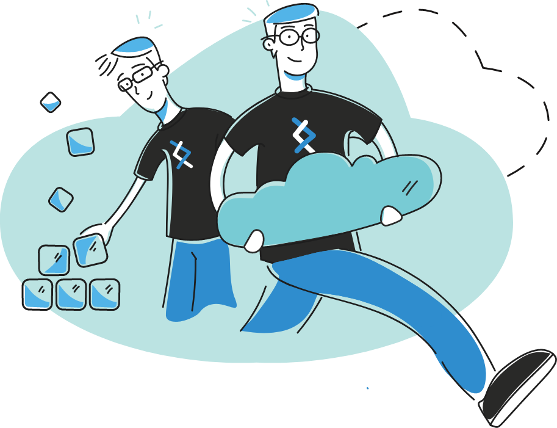

# Cost report generator

## Requirements

- Docker
- AWS Credentials

## Google Sheets API access

Follow the instructions at
https://developers.google.com/sheets/api/quickstart/python to setup credentials
and API access.

## Argument variables

---

**Variable**:`--no-clear-before`

**help**: Do not clear all data before doing anything. Useful when a previous invocation failed or when you add data incrementally before generating the sheet.

---

**Variable**:`--no-generate-xlsx`

**help**: Do not generate a XLSX file after all data was retrieved.

---

**Variable**:`--xlsx-name`

**help**: Name of the XLSX file.

---

**Variable**:`--generate-gsheet`

**help**: Generate a Google Sheet after all data was retrieved.

---


**Variable**:`--billing`

**help**: Get billing data from s3:/BUCKET/PREFIX using PROFILE.

---


**Variable**:`--ec2`

**help**: Get EC2 data for PROFILE.

---

**Variable**:`--use-sso-auth`

**help**: Get the authentication method.

---


**Variable**:`--sso-profile`

**help**: Get the SSO profile.

---
## How to run the tool on your machine


1. Run it using Makefile:
    - `make` -> build the image and run it. 
    - `make buid` -> Just build the image locally. 
    - `make run` -> Run the container using the latest local image. 
    - `make shell` -> Run the container using the latest local image and iterate with it using /bin/bash.


## How to run the tool with docker

The docker container do not export any data to google sheets.
However it generates CSVs in the `out` directory, and a local spreadsheet generation will be added soon.

### Use our prebuilt image

```
# Pull the msolution/aws-cost-report image
$> docker pull msolution/aws-cost-report
```

### Build your own image

```
# Build your own msolution/aws-cost-report image
$> docker build -t msolution/aws-cost-report .
```

## Screenshots

Download the report example [here](https://s3-us-west-2.amazonaws.com/trackit-public-artifacts/aws-cost-report/report-example.xlsx).

### Cost and variations tab


### Reserved instance summary


### Instance size recommendations


### EC2 instances last month


